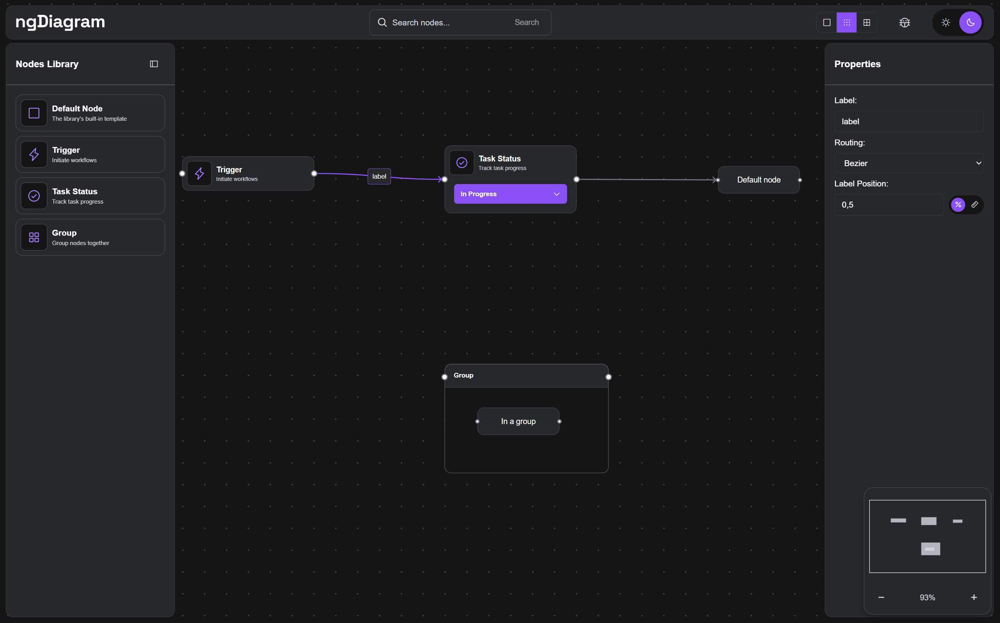

# ngDiagram Feature Demo

[](https://opensource.org/licenses/MIT)

**Live demo:** [synergycodes.github.io/ng-diagram-demo](https://synergycodes.github.io/ng-diagram-demo/)



A showcase of [ngDiagram](https://www.ngdiagram.dev/) — an Angular library for creating interactive diagrams. One app wires up the library's main features side by side: custom node and edge templates, a drag-and-drop palette, grouping, a clipboard context menu, snapping, rotation, and a custom middleware.

## Project Structure

### 📁 `src/app/diagram/` - **Main ngDiagram Integration**
This directory contains all the core ngDiagram logic and showcases how to use the library. **Start here to learn ngDiagram!**

- **`diagram.component.ts`** - Main diagram component with documentation on:
  - ngDiagram services (ModelService, SelectionService, ViewportService, etc.)
  - Event handling (all diagram events with examples)
  - Configuration setup
  - Model initialization

- **`services/`**
  - `diagram.config.ts` - NgDiagramConfig with snapping, zoom, rotation, etc.
  - `properties-facade.service.ts` - Properties panel integration
  - `debug-events.service.ts` - Complete event handling reference
  - `context-menu-facade.service.ts` - Clipboard and z-order operations

- **`palette/`** - Drag & drop palette system:
  - `palette-data.ts` - Palette item definitions
  - `palette.component.ts` - How ngDiagram drag & drop works
  - Components for palette items and drag previews

- **`node-templates/`** - Custom node components:
  - `trigger-node/` - Basic node with ports, resize, and rotation
  - `custom-node/` - Interactive node with status dropdown
  - `group-node/` - Container node for grouping
  - `node-template-map.ts` - Type-to-component mapping

- **`edge-templates/`** - Custom edge components:
  - `custom-edge/` - Edge template with label support

### 📁 `src/app/ui-components/` - **Supporting UI Components**
Angular components that provide the UI around the diagram (navbar, sidebars, properties panel, context menu).

### 📁 `src/app/types.ts` - **Type Definitions**
Shared TypeScript interfaces used across the application.

### 📁 `src/app/diagram/middlewares/` - **Custom Middleware**

- **`horizontal-lock.middleware.ts`** - Demonstrates how to constrain node movement using the middleware pipeline. Nodes with **Lock vertical movement** checked in the properties panel are restricted to X-axis movement only (their Y position stays locked). Select any node, tick the checkbox, and drag it around.

## Getting Started

Built against Angular 21.2 and ngDiagram 1.3 (see `package.json`); Node.js 20.19+ or 22.12+ and npm 10+.

```bash
git clone https://github.com/synergycodes/ng-diagram-demo.git
cd ng-diagram-demo
npm install
npm start
```

Open [http://localhost:4200](http://localhost:4200) — a small diagram loads with every node template side by side: the library's default node, the two custom templates, and a group with a child. Try dragging new nodes in from the left palette, right-clicking a node for the clipboard context menu, and ticking **Lock vertical movement** on a selected node - a custom middleware then pins its Y position while you drag. `npm run build` compiles to `dist/`.

Working with an AI coding tool? Copy [`mcp.json`](mcp.json) to `.mcp.json` (or your tool's MCP config) to add the ngDiagram docs MCP server — searchable ngDiagram documentation and API reference right in the session. The file carries the Windows command; the macOS/Linux variant is noted inside.

## Support

- **Issues**: [GitHub Issues](https://github.com/synergycodes/ng-diagram-demo/issues)
- **ngDiagram Discussions**: [GitHub Discussions](https://github.com/synergycodes/ng-diagram/discussions), [Discord](https://discord.gg/FDMjRuarFb)
- **ngDiagram Documentation**: [ngdiagram.dev/docs](https://www.ngdiagram.dev/docs)
- **More diagramming resources**: [synergycodes.com/diagramming-resources](https://www.synergycodes.com/diagramming-resources)

## License

MIT — see [LICENSE](LICENSE).

---

Built with ❤️ by the [Synergy Codes](https://www.synergycodes.com/) team
